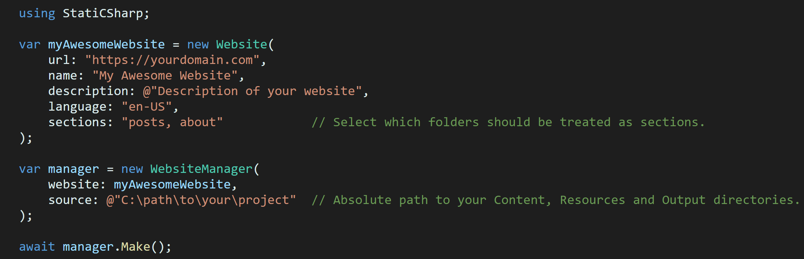

# C# to colored HTML parser

<p align="center">
    <a href="https://docs.microsoft.com/en-us/dotnet/csharp/">
        
    </a>
    <a href="https://dotnet.microsoft.com">
        
    </a>
    
    
    <a href="https://www.nuget.org/packages/StatiCSharp.Parser.CSharpToColoredHtml">
        
    </a>
</p>

This is a port of [Swiftly1](https://github.com/Swiftly1)'s [CsharpToColouredHTML](https://github.com/Swiftly1/CsharpToColouredHTML) for [StatiC#](https://github.com/RolandBraunDev/StatiCSharp), a static website generator for C# developers. Requiring StatiC# 0.4.0 or higher.

By injecting this parser into StatiC#'s website-generating process all code parts of your markdown files are rendered to look as if it was inside Visual Studio or Visual Studio Code.

## Example

<p align="center">
    
</p>

## How to use

Initiate a new instance of the parser. It's optional to disable line numbers in the output. Then  inject the parser into StatiC#'s website manager:

```C#
using StatiCSharp.Parser.CSharpToColoredHtmlParser;

// ...

var parser = new CSharpToColoredHtmlParser()
    .DisableLineNumbers();                      // Optional

manager.AddParser(parser);

await manager.Make();
```

You have to mark the code parts in the markdown files:

```
Lorem ipsum dolor sit amet, consectetur adipiscing elit, sed do eiusmod tempor incididunt  
ut labore et dolore magna aliqua. Ut enim ad minim veniam, quis nostrud exercitation  
ullamco laboris nisi ut aliquip ex ea commodo consequat.

```csharp
// Your C# code in here...
`` ``` ``


Lorem ipsum dolor sit amet, consectetur adipiscing elit, sed do eiusmod tempor incididunt  
ut labore et dolore magna aliqua. Ut enim ad minim veniam, quis nostrud exercitation  
ullamco laboris nisi ut aliquip ex ea commodo consequat.
```

## CsharpToColouredHTML

=> Check out the original project of Swiftly1 here: [Link](https://github.com/Swiftly1/CsharpToColouredHTML)